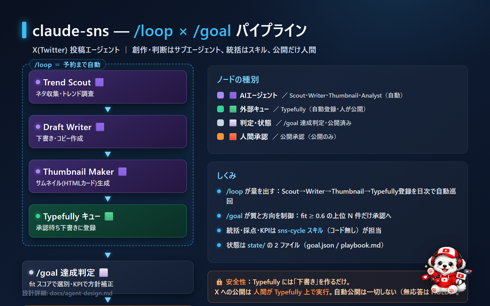

# claude-sns — X(Twitter) 投稿エージェント (/loop × /goal)



`Trend Scout → Draft Writer → Thumbnail Maker → Typefully キュー → /goal 達成判定 → 公開承認(人間) → 公開済み → Post Analyst`
のパイプラインを **Claude Code のサブエージェント＋スキルだけ**で構成。コードは無し。設計は [docs/agent-design.md](docs/agent-design.md)。

> **安全性**: 本番(LIVE)でも Typefully には「下書き」を作るだけ。X への公開は人間が Typefully 上で行う。
> 「予約まで自動・公開だけ承認」を守るため、自動公開は一切しない。

## 構成（これだけ）
```
.claude/
├ agents/                    各エージェント = サブエージェント（Agent ツールで起動）
│  ├ trend-scout.md          ネタ収集・トレンド調査 🟪
│  ├ draft-writer.md         下書き・コピー作成 🟪
│  ├ thumbnail-maker.md      サムネイル(HTMLソーシャルカード)生成 🟪
│  └ post-analyst.md         反応分析・改善メモ 🟪
└ skills/
   └ sns-cycle/SKILL.md      /loop の1サイクル統括（/goal 達成判定を内包）
state/                       共有状態 = ループの記憶（2ファイル）
├ goal.json                  ゴール・ボイス・KPI・通知先（人が編集する唯一のソース）
└ playbook.md                改善メモ（Analyst が追記 / Scout・Writer が参照）
workflow/
├ progress/YYYY-MM-DD.md      進捗ログ（件数サマリ）
└ runs/<実行ID>/             生成物（毎回保存）
   ├ drafts.md               下書き本文
   └ thumb-<n>.png           サムネイル(OpenAI Image API で生成した一枚絵)
docs/agent-design.md         設計
```
投稿の記録・反応・公開状態は **Typefully を正**とする（ローカル台帳は持たない）。
生成した下書き本文とサムネイルは、レビュー用に `workflow/runs/<実行ID>/` へ常に残す。
サムネイルは **OpenAI Image API**（`thumbnail-maker` がプロンプトを作り、sns-cycle が `curl` で生成）。
ブランド設定（モデル・サイズ・スタイル・キャラ・色）は `state/goal.json` の `thumbnail` で調整。

## 使い方（Claude Code）
```
/sns-cycle            1サイクル手動実行（Analyst→Scout→Writer→/goal→キュー→Slack承認依頼）
/loop 1d /sns-cycle   日次で自動巡回（= 設計の /loop）。クラウドなら /schedule でも可
```
サブエージェント（trend-scout 等）は `/名前` では起動できず、sns-cycle が Agent ツールで起動する。

## 動作のしくみ
- **創作・判断**（Scout / Writer / Analyst）は `.claude/agents/` のサブエージェントが実行。Scout は WebSearch でトレンド調査も可。
- **統括・採点・KPI**は sns-cycle スキルが行う（コード無し）。
  - /goal 採点: `fit = 0.4*goal_fit + 0.2*voice + 0.2*freshness + 0.2*(1-risk)`、しきい値 0.6、
    exploit は tips/thread 加点・explore は新鮮度加点で上位 `posts_per_day` 件を承認へ。
- **サムネイル**は承認分のみ生成。`thumbnail-maker` が画像生成プロンプトを組み立て、sns-cycle が **OpenAI Image API**（`OPENAI_API_KEY` があるとき）を `curl` で呼び `thumb-<n>.png` を保存。キーが無ければ画像はスキップし、プロンプトだけ残す。
- **Typefully**（`LIVE=1` ＋ `TYPEFULLY_API_KEY`）が下書きキュー・公開・反応分析の置き場。未設定なら計測・KPI はスキップし、下書き案と承認依頼のみ。
- **承認依頼**は接続済み Slack MCP で `goal.notify.slack_channel` へ。公開は人間が Typefully で実行（無応答は HOLD）。

## 設定
- `state/goal.json` を自分のアカウント・ボイス・KPI・通知先に編集（唯一のソース）。サムネのモデル/サイズ/スタイル/キャラは `thumbnail` で調整。
- **APIキーは `.env` に置く**：`.env.example` を `.env` にコピーして値を埋める（`.env` は `.gitignore` 済み）。
  ```bash
  cp .env.example .env   # 編集して OPENAI_API_KEY / TYPEFULLY_API_KEY / LIVE を設定
  ```
  - サムネ画像生成: `OPENAI_API_KEY`（既定モデル `gpt-image-1`、16:9 の `2048x1152`）。
  - Typefully 実接続: `TYPEFULLY_API_KEY` と `LIVE=1`。
  - sns-cycle は API 呼び出し前に `.env` を自動で読み込む。

## 既知の TODO / 要確認
- Typefully API の認証ヘッダ名・反応メトリクスのフィールド名は公式ドキュメントで最終確認。
- 重複チェックは Typefully の直近公開を Writer に渡して行う（DRY では履歴が無いため最小限）。
- 承認→公開→反応の反映は Typefully 側。Webhook 連携で進捗ログへ自動反映が次段。
